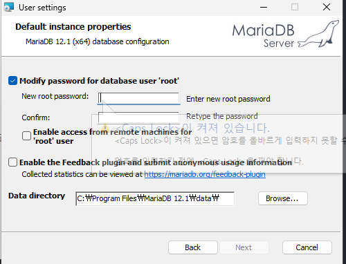

# MariaDB 및 HeidiSQL 설치

# 
계정명 :root
password:1234

portnumber 3310

나머지는 다 고정

git 처음에푸시하기

맨처음에 c드라이브 내이름에 파일만들기

git init

1. git config user.name "dnwls0022"
2. git config user.email "dnwls9327487@gmail.com"
git add .
3. git commit -m "first commit"
4. git branch -M main
5. git remote add origin https://github.com/dnwls0022/korit_12_sql.git
6. git push -u origin main