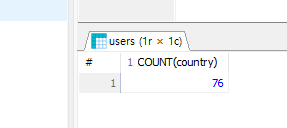
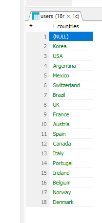
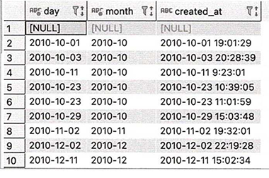
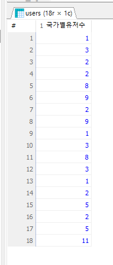

# order by
-어떤 순서로볼지 
1. 문자를 오름/내림차순
2. 숫자를 오름/내림차순
desc 내림 큰거부터작은거
asc 오름 작은거부터큰거
* 문제 : users에서 id 기준으로 오름차순 정렬해보기
```sql
SELECT * 
  FROM users ORDER BY id ASC;
```
- 다른컬럼을기준으로도할수잇음
* 문자 : City기준  오름차순 정렬
```SQL
SELECT * FROM users ORDER BY city ASC;
```
* 문제 : created-at 기준 내림 차순 정렬
```SQL
SELECT * FROM users ORDER BY created_at DESC;
```
- order by는 컬럼명을 몰라도 정렬하는것이 가능하다. _몇 번째 컬럼인지 숫자로입력해도 가능하다....몇 번 째 컬럼인지 숫자로 입력해도 가능 하다는 점입니다.
* 문제 : users 테이블의 첫 번째 컬럼기준으로 내림차순정렬
```SQL
SELECT * FROM users ORDER BY 1 DESC;
```
* 문제 : users 테이블에서 username, phone, city, country, id 를 순서대로 보여줄 수 있도록 SELECT 문을 쓰고, 첫 번째 컬럼을 기준으로 오름차순 정렬하시오.
```SQL
SELECT username, phone, city, country, id FROM users ORDER BY 1 ASC;
```
- 만약 id를 기준으로 오름차순되기를 바랏다면 결과값이 이상하게나왔겠지만 order by 절의 실행순서를 파악할필요가잇는데 select절의 실행결과를 기준으로 정렬하기때문에 이상의쿼리문을기준으로 1번컬럼이 usersname이 되어 usersname varchar 기준으로 오름차순된다고볼수잇다. (유저네임이 첫번째가 되어서 첫번째 컬럼을기준으로 오름차순정렬시킨다.)
** !!!ORDER BY는 SELECT가 이미 물건을 다 꺼내서 순서를 정해놓은 뒤에 작동합니다!! **
- select로 컬럼순서를 바꿧지만 id순서로 asc하기위해서는 컬럼명을 명시하는것이 바람직하다.(id를정렬할꺼면 id라고 order by뒤에명시해주기)
```SQL
SELECT username, phone, city, country, id FROM users ORDER BY id ASC;
```
- 복수오더바이 가능!!! , 한 개 이상의 정렬 기준을 잡을 수 있습니다. ORDER BY 1번컬럼 ASC/DESC, 2번컬럼 ASC/DESC 와 같은 방식으로 작성할 수 있는데, 이상의 경우 1번컬럼을 기준으로 먼저 정렬을 수행한 다음에 2번 컬럼에서 재정렬을 수행합니다.
* 문제 : users에서 city, id 컬럼만 출력하고, 거주 도시 기준으로 내림차순, 회원 아이디 기준 오름차순 정렬하시오.
```SQL
SELECT city, id FROM users ORDER BY city DESC, id ASC;
```
먼저 city기준으로 내림차순정렬한뒤 동일한 city값 내에서는 id를 기준으로 오름차순정렬하라는 의미....... 그렇다면 order by이후에 명시하는 컬럼명의 순서도 신경쓸필요가있다..

* 문제 : products 테이블에서 정상 가격이 비싼 제품부터 순서대로 모든 컬럼 출력하시오.
```SQL
SELECT * FROM products ORDER BY price DESC;
```
* 문제 : orders에서 주문 일자 기준 최신순으로 정렬하여 모든 컬럼을 출력하시오.
```SQL
SELECT * FROM orders ORDER BY order_date DESC;
```
* 문제 : orderdetails 테이블에서 제품 아이디를 기준으로 내림 차순 정렬하고, 같은 제품 아이디 기준으로 판매 수량을 기준으로 오름 차순 정렬하여 모든 컬럼을 출력하시오.
```SQL
SELECT * FROM orderdetails ORDER BY product_id DESC, quantity ASC;
```
- SELECT / FROM/ WHERE /ORDER 심화
배달서비스에서어떤 방식으로적용하는가...?

* 1.2023-08-01에 주문한 내역 중 쿠폰 할인이 적용된 내역만 추출하기.
```SQL
SELECT *
  FROM 주문정보
  WHERE 주문일자 =  '2023-08-01'
  AND쿠폰할인금액 >0
  ;
```
* 2.---에서 1인분 배달이가능한 배달음식점만추출
```SQL
SELECT *
 FROM 음식점 정보 
 WHERE 지역 = '마포구'
  AND 1인분가능여부 = 3
```
- 전자책 서비스에서 어떻게쓰는가?
* 3. 출간한지 한달 이내 신간도서중 페이지 수가 200이상인 도서관추출
```SQL
SELECT *
  FROM 도서정보
  WHERE 출판일자 >= (오늘일자-1달) AND 페이지수 >=200
    ;
```
* 4. 최근한달 이내에 도서 구독 맴버십에 가입한 회원만추출
```SQL
SELECT *
  FROM 회원정보
  WHERE 가입일자 >=(오늘일자-1일) AND 맴버십가입여부 =1
```
- 참고 - 오늘일자를 가져오는부분과 특정일자에서 한달 차감하는 함수가 DB별로 다를 수 있기에 정형화하지않음... 

# 묶어서 계산하기
- GROUP BY
그룹별로 집계함수 적용하기 위해 데이터를 나누는 GROUP BY
묶어서 데이터계산 
- 엑셀 기준 합 / 평균/ 개수 셀때 
  SUM AVG COUNT  
  SQL에서도 마찬가지로 함수를 사용해서 동일 작업가능하다..
- 합 / 평균/ 개수 세는등의 집계함수 
- 문자열을 잘라내거나 대소문자 변경 등을 수행하는 일반함수가존재한다...
```sql
SELECT COUNT(id) AS cnt FROM orderdetails;  
```
전체 데이터에 함수를 적용하기도 하지만 그룹별로 수치를 도출하는 일도 자주잇다... 그런경우 group by로 데이터를 그룹으로 묶은 후 필요함수를 적용한다.

orderdetails의 전체건수를 확인하기 위해 product_id를 기준으로 적용한다던가 등 일부컬럼을가지고 세세한개수를 파악한것이 쉽지않다. 하지만 GROUP BY를 적용했을 때는 '국가별 회원 수를 계산하기' 혹은 '일별 매출을 계산하기' 등으로 좀 더 세분화해서 사용할 수 있습니다
- gruop by 로 계산한 결과를 필터링하는 HAVING
- GROUP BY를 사용하면 국가별회원수를 추출하는것은 가능하지만 그중 마케팅효율을 높이기위해 국가별 회원수를 추출하고 그 중에서 회원수가 10명이상인국가만 재추출하는등의 집계함수로 계산한 결과 중에서 조건에 맞는 데이터만 필터링하는 경우도존재한다
- 그럴경우 일단 !!! 집계함수가 적용된 이후에 WHERE을 써야한다는것!!!!임 집계되기 전에 미리생각하고 WHERE절을 설계하는것이 쉽
지 않기 때문에 그룹바이 집계함수의 '결과값'을 필터링할때 HAVING을쓴다.  
HAVING 의 경우 GROUP BY이후가된다.
# 집계 함수
1. COUNT : ROW새수 세기
2. AVG
3. SUM
4. MAX
5. MIN
```SQL
SELECT COUNT(*) FROM users;
```
회원테이블의 row개수추출 'count(*)'
는 대상 테이블에 있는전체행의 개수를세는역할을 한다.

- users에서 존재하는 국가의 수 세기

```sql
SELECT COUNT(country) FROM users;

```
- 전체 row는 77개지만 데이터기준 1번 row가 country가 null이기때문에 null은 세지않고 76이나옴
- count함수는 null이 아닌 행의 개수를 반환(return)한다.

- 도시기준으로 내림차순했을때 Seoul이 여러개있고 korea도 여러개인데 76나왔으니 중복을 포함하여카운팅했다.

- distinct 중복제외!
EX)users에서 존재하는 국가를 세어보기(중복 제외)
```SQL
SELECT COUNT(DISTINCT country) FROM users;

SELECT DISTINCT country AS countries FROM users;
```

- count쓰면 숫자로 개수만! 안쓰면 그 값의 목록들을 null값포함 다 보여준다.
- null은 집계함수상에서 카운팅되지않은것이고 그냥 보여줄때는 나온다 . 
# 최소,최대값 추출
-  MAX: 최대값 .*문자열* 도 사용가능
-  MIN: 최소값 .*문자열* 도 사용가능 
* 1. 제품 정보 테이블에서 최저가를 추출하시오.(정상가 기준)
```SQL
SELECT MIN(price) FROM products;
```
* 2. 제품 정보 테이블에서 최대가를 추출하시오.(할인가 기준)
```SQL
SELECT MAX(discount_price) FROM products;
```
* 3. 제품 정보 테이블에서 정상가격의 합계를 추출하시오.
```SQL
SELECT ROUND(SUM(price), 2) FROM products;
```
* 4. 제품 정보 테이블에서 정상 가격의 평균을 추출하시오(단, 결과값의 컬럼명을 avgPrice로 변경하고 소수점 둘째자리까지만 추출할 것).
- ROUND() 함수입니다 -> 사용법은 python과 같음.
```sql
SELECT round(AVG(price),2) AS avgPrice 
	FROM products;
```
EX) users에서 회원의 가입일자(일까지 출력), 가입년월(월까지 출력), 가입일시(created_at)만 출력하기
```sql
SELECT SUBSTR(created_at, 1, 10) AS day, SUBSTR(created_at, 1, 7) AS month ,created_at FROM users;
```
- SUBSTR(p1,p2,p3) 
 p1: 잘라내기할 varchar자료형
 p2: 시작인덱스(1번부터시작)
 p3: 종료인덱스(안쓰면 끝까지추출)


EX) ex: users에서 username의 문자열길이
```sql
SELECT LENGTH(username)as len, username from users 
```
LENGTH - 함수 문자열길이
문자열 길이를 반환하는것이 동일하다...그런데 len()으로만 쓸떄도잇다

upper() (대문자로변경) 
lower() (소문자로변경)
 집계 - 다수의 값 대상
 일반 - 하나의 대상
# 일반함수 - ROW에추가적인조작
1. round (p1 p2 p3)
2. SUBSTR(p1,p2,p3) -p2 시작위치 -p3 가져올문자열의 개수
3. LENGTH()       
4. upper()
5. lower()

-집계 함수는 여러 행의 데이터를 하나의 결과값으로 _집계_ 하는 반면 일반 함수는 _한행의 데이터에 하나의 결과값_ 을 대상으로 한다.따라서 **집계함수는 SELECT에서만 사용가능하고 하지만 일반함수는 SELECT에서도 쓸수 있고 WHERE절에서도 쓸 수 있다** 

* 1. products에서 정상 가격을 모두 더한 값을 구하시오 그리고반올림 2번째자리(컬럼명 합계).
```SQL
SELECT ROUND(SUM(price), 2) AS 합계 
    FROM products;
```
* 2. products에서 제품 아이디가 30이하인 제품의 정상 가격의 평균을 구하시오(단 소수점 둘째자리까지, 컬럼명 평균).
```SQL
SELECT ROUND(AVG(price), 2) AS 평균 
  FROM products 
  WHERE id < 31
;
```
* 3. users에서 가입일시가 2010-10부터 2010-12까지인 회원 아이디를 중복 없이 센 값을 출력하시오(컬럼명 유저수).
```sql
SELECT count(DISTINCT id)  AS 유저수
	FROM users
	WHERE substr(created_at,1 ,7) BETWEEN '2010-10' AND '2010-12';
```
* 4. users에서 이메일의 길이가 17자리 이하인 회원 수를 중복없이 센 값을 출력하시오(컬럼명 유저수).
```SQL
SELECT COUNT(DISTINCT id) AS 유저수 FROM users WHERE LENGTH(email) < 18;
```
1. yyyy mm dd hh:mm:ss 로 했을때 공백을 기준으로 연원일/시간으로 잡는데 yyyy-mm을 기준으로 잡는부분이 설정이되어있지않다. 그래서 명시적으로 잘라는것을 기준으로한다.


# group by 
select문에 집계함수를 적용하고 일반함수를 select와 where절에서 사용했다. 집계함수를 select절로 쓰게 될경우 생겨나는 한계가있는데 데이터전체가아닌 원하는 원하는기준으로그룸을 나눠서계산이 제한이있엇다. 전체회원수가아닌 국가별회원수를 나눌때 문제가발생

Korea는 몇 명인지, USA는 몇 명인지 하려면 기존에는
- 국가가 한국인애 카운트
- 국가가 미국인애카운트  다음에 사람이 직접 더해야 함
```sql

SELECT COUNT(id)  
		FROM users
		WHERE country= 'Korea';

SELECT COUNT(id)
		FROM users
		WHERE	country = 'USA';
```
8+11 =19

기본적으로 COUNTRY 내에 무슨값이있는지 한번더 체크해야한다/

EX) USERS에서 국가별 회원수추출
```SQL
SELECT country, COUNT(distinct id) as 국가별 회원수 from users group by country; 
SELECT country, COUNT(DISTINCT id) AS 국가별회원수
FROM users
GROUP BY country;	
```
국가별 회원수확인가능 group by는 _집계 함수와 함께_ 사용되며  GROUP BY 기준 컬럼은 SELECT에서 집계 함수를 사용할 때 묶어서 계산을 수행하는 기준이 됩니다.

- SELECT 절에만 집계함수를 쓸 수 있음.
- GROUP BY를 명시하지 않았을 때는 전체 row를 기준으로 집계 함수가 일어남 -> 테이블 전체를 기준으로 id 개수를 세든지 총합을 구하든지, 최대값, 최소값을 출력하든지 하게 됩니다.
- GROUP BY 컬럼명을 명시하게 될 경우에는 해당 컬럼의 중복되는 row값들을 다 합치게 될겁니다. 그렇다면 GROUP BY까지 포함한 쿼리문의 연산 결과에 대한 전체 row 의 개수를 미리 알 수 있을 겁니다.

```sql
SELECT COUNT(DISTINCT country) FROM users;
```
- 거기에 GROUP BY 컬럼명a을 작성했다면 가시성을 위해 SELECT문에도 컬럼명a를 명시해주는 것이 어떤 값에 집계함수 결과가 무엇인지를 명확하게 보여주는 방법이 될 것입니다.
- group이 이루어질 컬럼명을 명시하지않앗을때 가시성이 망가진결과



오후
* 1.  거주 국가가 한국인 회원 중 마케팅 수신에 동의한 회원 수를 추출하시오.
```SQL
SELECT COUNT(DISTINCT id) 
  FROM users 
  WHERE country = 'Korea' 
    AND is_martketing_agree = 1
  ;
```
* 2.  영국인 회원 중 마케팅 수신에 동의한 회원 수를 추출하시오.
```SQL
SELECT COUNT(DISTINCT id) 
  FROM users 
  WHERE country = 'UK' 
    AND is_marketing_agree = 1  
  ;
```
1, 2의 경우 GROUP BY가 필요없습니다.
* 3.  국가별로 마케팅 수신 동의를 한 회원 수와 동의하지 않은 회원 수를 국가별 오름차순, 회원 수별 내림차순으로 추출하시오(컬럼명 동의사용자).
```SQL
SELECT country, is_marketing_agree AS 동의(1), COUNT(DISTINCT id) AS 동의사용자
  FROM users
  GROUP BY country, is_marketing_agree
  ORDER BY country, 동의사용자 DESC
  ; 
```
- ORDER BY 부분에서 '동의사용자 DESC'부분입니다. 원래 is_marketing_agree라는 이름의 column이 있기 때문에 우리가 재가공한 이름(동의사용자)를 기준으로 내림차순 정렬을 할 수 있는가 여부가 중요하다고 할 수 있겠습니다.

- 이미 굴려봤을 때 실행이 된다는 점에서 우리가 주목해야 할 점은 다음과 같습니다.
ORDER BY 문은 SELECT까지의 SQL문의 연산을 한 결과를 바탕으로 '재정렬'시켜주기 때문에 SELECT 절에서 column명을 바꾼 것을 기준으로 순서를 정렬합니다.

그러면 SELECT 절의 경우 모든 연산이 다 끝난 이후에 맨 마지막으로 ORDER BY가 실행된다는 점은 도출할 수 있습니다.
- SELECT절의 경우 모든 연산이 다 끝난 이후 맨 마지막으로 오더바이가 실행된다.
/02/09
Python
1과목
서답형
50?
오픈

2코딩 
인풋 컬렉션 클래스개념 리스트딕셔너리 4개의코딩 개당25점 


